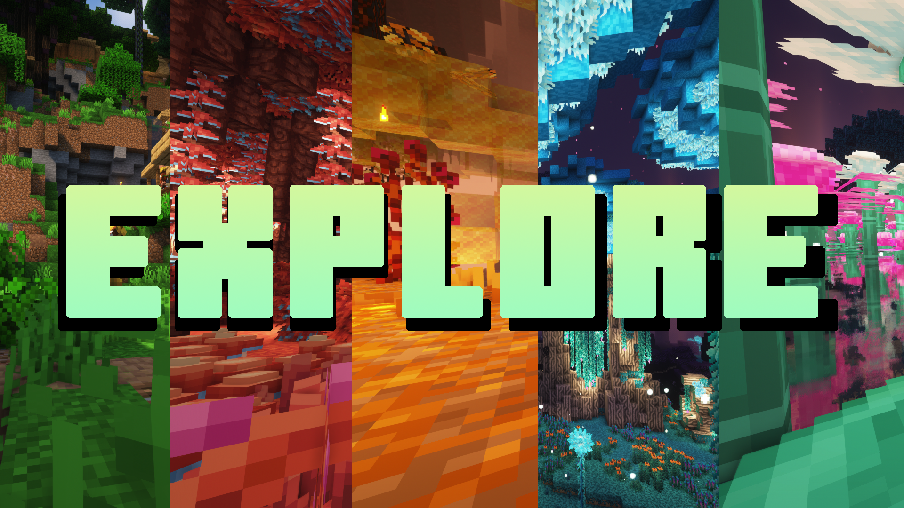

# Explore [ Fabric ]

[中文 README](https://github.com/IntoSky0405/Explore-Modpack/blob/main/README_Chinese.md)
## Introduce
This is an adventure Modpack, a not so simple Modpack. explore the huge dungeons, upgrade your weapons and defeat the powerful monsters. Kill all kinds of bosses and complete your journey!
## Features
* New version [1] for an even better experience!
* CurseForge, Modrith and MCBBS format support!
* Vanilla ++, with mods and Config to make the original Vanilla even more vanilla!
* A lot of weapons and powerful bosses await you.
* More optimized mods to increase your frame rate.
* Advancements and Patchouli Book to take you into the world of exploration

⚠️The development version does not represent the final quality, actual features may be added or removed. ⚠️

[1] Minecraft 1.19.2

## Installing and Downloads
Development is currently in Alpha stage, download is not available, try to build it yourself, thanks :)
